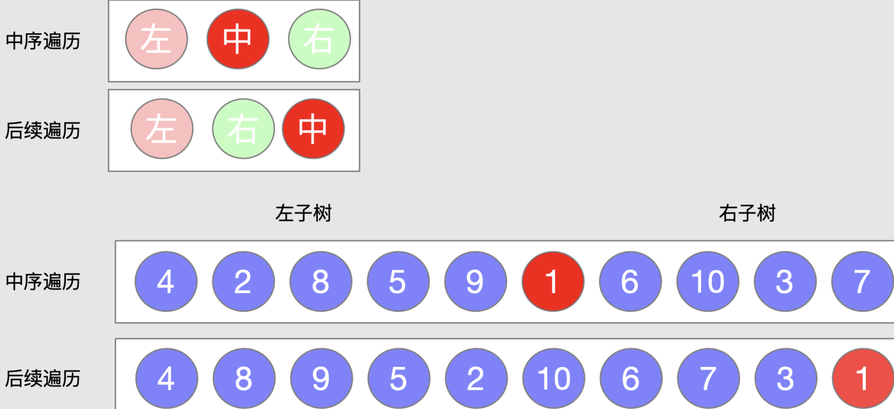

# LeetCode144/94/145:二叉树的前中后序遍历

## 树节点的定义

```java
/**
 * Definition for a binary tree node.
 * public class TreeNode {
 *     int val;
 *     TreeNode left;
 *     TreeNode right;
 *     TreeNode() {}
 *     TreeNode(int val) { this.val = val; }
 *     TreeNode(int val, TreeNode left, TreeNode right) {
 *         this.val = val;
 *         this.left = left;
 *         this.right = right;
 *     }
 * }
 */
```

## 非递归实现一

### 前序

```java
class Solution {
    public List<Integer> preorderTraversal(TreeNode root) {
        Stack<TreeNode> stack = new Stack<>();
        List<Integer> res = new LinkedList<>();
        
        while(root != null || !stack.empty()){
            if(root != null){
                res.add(root.val);
                stack.push(root);
                root = root.left;
            }else root = stack.pop().right;
        }
        
        return res;
    }
}
```

### 中序

```java
class Solution {
    public List<Integer> inorderTraversal(TreeNode root) {
        List<Integer> res = new LinkedList<>();
        Stack<TreeNode> stack = new Stack<>();
        
        while(root != null || !stack.empty()){
            if(root != null){
                stack.push(root);
                root = root.left;
            }else{
                res.add(stack.peek().val);
                root = stack.pop().right;
            }            
        }
        
        return res;
    }
}
```

### 后序

```java
class Solution {
    public List<Integer> postorderTraversal(TreeNode root) {
        List<Integer> res = new LinkedList<>();
        Stack<TreeNode> stack = new Stack<>();
        TreeNode pre = null;
        
        while(root != null || !stack.empty()){
            while(root != null){
                stack.push(root);
                root = root.left;
            }
            root = stack.peek();
            if(root.right == null || root.right == pre){
                res.add(root.val);
                pre = root;
                root = null;
                stack.pop();
            }else{
                root = root.right;
            }
        }
        
        return res;
    }
}
```

---

## 递归实现

### 前序递归

```java
class Solution {
    public List<Integer> preorderTraversal(TreeNode root) {
        List<Integer> res = new LinkedList<>();
        helper(root, res);
        return res;
    }
    
    private void helper(TreeNode root, List<Integer> res){
        if(root == null) return;
        res.add(root.val);
        helper(root.left, res);
        helper(root.right, res);
    } 
}
```

### 中序递归

```java
class Solution {
    public List<Integer> inorderTraversal(TreeNode root) {
        List<Integer> res = new LinkedList<>();
        helper(root, res);
        return res;
    }
    
    private void helper(TreeNode root, List<Integer> res){
        if(root == null) return ;
        helper(root.left, res);
        res.add(root.val);
        helper(root.right, res);
    }   
}
```

### 后序递归

```java
class Solution {
    public List<Integer> postorderTraversal(TreeNode root) {
        List<Integer> res = new LinkedList<>();
        helper(root, res);
        return res;    
    }
    
    private void helper(TreeNode root, List<Integer> res){
        if(root == null) return ;
        helper(root.left, res);
        helper(root.right, res);
        res.add(root.val);
    }
}
```

---

## 遍历总结

对于递归实现的三种遍历方式，都能很快理解流程，并且能够很快写出代码，执行效率也比较高

### 非递归实现的说明

#### 前序遍历

使用栈来记录已经遍历到的元素，每次进入循环都会判断一下根节点是否为空，或者栈是否为空，如果两者都是空那么说明二叉树已经遍历完了，进入循环后，首先判断 root 节点是不是 null ，如果不是 null 则将其压入栈中，并将 root 节点的值添加到 res 中，并将 root 指向 root 的左子树，不断向左子树遍历，直到最后 root 为空，此时将 root 指向栈顶的元素的右子树，再次进行向左子树的遍历，重复上述的流程直到 root 和 栈 都为空为止

#### 中序遍历

和前序遍历类似，只是添加节点值到 res 这一步骤中有所改变，前序遍历是遇到一个非 null 节点就将节点的值加入到 res 中，而中序遍历则需要当某一个节点的左子树都遍历完后才能添加该节点的值到 res 中，所以添加值时的操作延后到了 节点为 null ，要切换到右子树遍历时才将栈顶元素的值添加到 res 中，并切换到右子树

#### 后序遍历

后续就比较复杂了，因为后续遍历是需要将左右子树都遍历完后才能够将节点的值添加到 res 中的，所以节点的回溯处理会比较麻烦，上面的代码是这样处理的，在外层判断遍历终止的 while 循环内，嵌套了一个 while 循环来遍历左子树，即每次进入一个新的外层循环，都需要将节点遍历到左子树为 null 为止，然后将 root 指向栈顶元素，即左子树为 null 的节点，此时再进行一个判断，如果节点的右子树没有被访问过，则进入右子树重复上述过程，如果已经被访问过了，那么就可以把当前 root 的值加入到 res 中，并将 root 赋值为 null，同时将栈顶元素也弹出，这样可以让 root 下次进入循环时，获取到新的栈顶的值
判断是否已经访问过的逻辑也是比较复杂的，如果右子树为空可以视为已经访问过，但是右子树如果不为空，怎么处理呢，这里使用了一个新的指针 pre，指向上次被访问的元素，即如果一个元素的值被添加到了 res 中，那么 pre 就会指向这个元素，下次 root 从栈顶获取到新元素时，该 pre 恰好为其右子树，可以防止重复访问

---

## 如何从遍历的结果还原出一棵树

可以从遍历的结果中还原出树的结构，但是对给定的遍历方式的组合有一定的要求

### 从中序和后序遍历的结果中还原出一棵二叉树

后续遍历和中序遍历有如下两个特点，通过这两个特点能够帮助我们还原出一棵完整的二叉树

1. 后续遍历序列中，最后一个元素是树的根节点

2. 在中序遍历序列中，根节点的左边是左子树，右边是右子树



#### 如何通过上面的两个特点解题

1. 首先需要在树的后续遍历的序列中找到根节点(最后一个元素)

2. 根据步骤一找到的根节点在中序遍历序列中找到根节点的位置

3. 根据找到的根节点的位置，将中序遍历序列分为左右数组

4. 根据根节点的位置，在中序、后续遍历的序列中划分出左右边界

5. 递归构造左右子树

6. 返回根节点，结束递归

#### 还原过程中的辅助变量

1. HashMap map，用于构造一个数组值和下标的映射，提供 O(1) 的查询事件

2. int ri，根节点在中序遍历序列中的索引位置

3. is、ie 中序遍历的左右边界的下标，is 是左边界，ie 是右边界

4. ps、pe 后续遍历的左右边界的下标，ps 是左边界、pe 是右边界

#### 如何确定中后遍历序列的左右边界

在找到根节点后，如何确定后续遍历和中序遍历的数组边界

1. 

### 从中序和前序遍历的结果中还原出一棵二叉树
