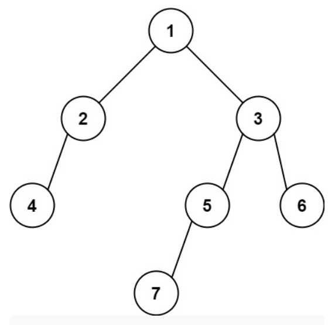

# LeetCode513:树的最左下角的值

## 题意理解: 这题的题干和题目描述不是很匹配，其实题目想要找的是深度最深的那一层最左边的叶子节点



**思路一**: 首先考虑层序遍历，因为层序遍历的次数就代表了树的深度，每次层序便利开始之前，遍历队列的队顶元素就是我们要找的元素

```java
class Solution {
    public int findBottomLeftValue(TreeNode root) {
        Deque<TreeNode> q = new LinkedList();
        TreeNode node = null;
        if(root != null) q.offer(root);
        
        int res = root.val;        
        while(!q.isEmpty()){
            int len = q.size();
            res = q.peekFirst().val;
            for(int i = 0; i < len; ++ i){
                node = q.poll();
                if(node.left != null) q.offer(node.left);
                if(node.right != null) q.offer(node.right);
            }
        }
        
        return res;
    }
}
```

---

**思路二**: 用层序遍历比较直观，其实深度优先遍历也挺方便，就是需要额外记录两个变量 —— 当前节点深度和树的最大深度，记录树深度的代码可以参考 [最小深度](./111_最小深度.md)，这个方法不是非常的直观

```java
class Solution {
    public int findBottomLeftValue(TreeNode root) {
        if(root == null) return 0;
        Stack<TreeNode> stack = new Stack<>();
    
        int res = root.val;
        TreeNode pre = null;
        int depth = 0;
        int maxDepth = Integer.MIN_VALUE;
        while(root != null || !stack.empty()){
            while(root != null){
                ++ depth;
                stack.push(root);
                root = root.left;
            }
            
            // 获取栈顶的节点
            root = stack.peek();
            // 判断这个节点是不是一个叶子节点
            if(root.left == null && root.right == null){
                // 这里利用了深度便利的一个重要特性，如果一个新节点的深度大于之前的最大深度，那么这个节点一定是这一层最左边的节点，也就是我们要找的节点
                if(depth > maxDepth){
                    res = root.val;
                    maxDepth = depth;
                }
            }
            
            if(root.right != null && root.right != pre) root = root.right;
            else{
                -- depth;
                pre = root;
                root = null;
                stack.pop();
            }
        }
        return res;
    }
}
```
